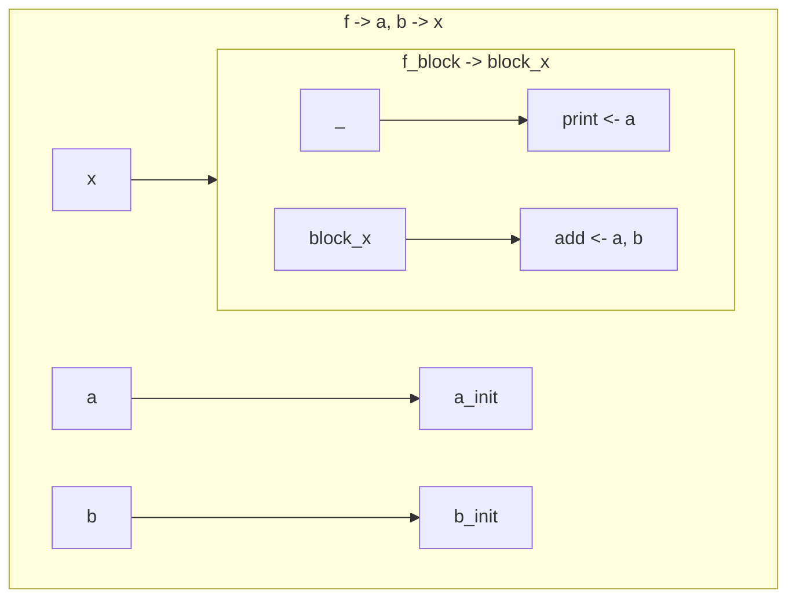
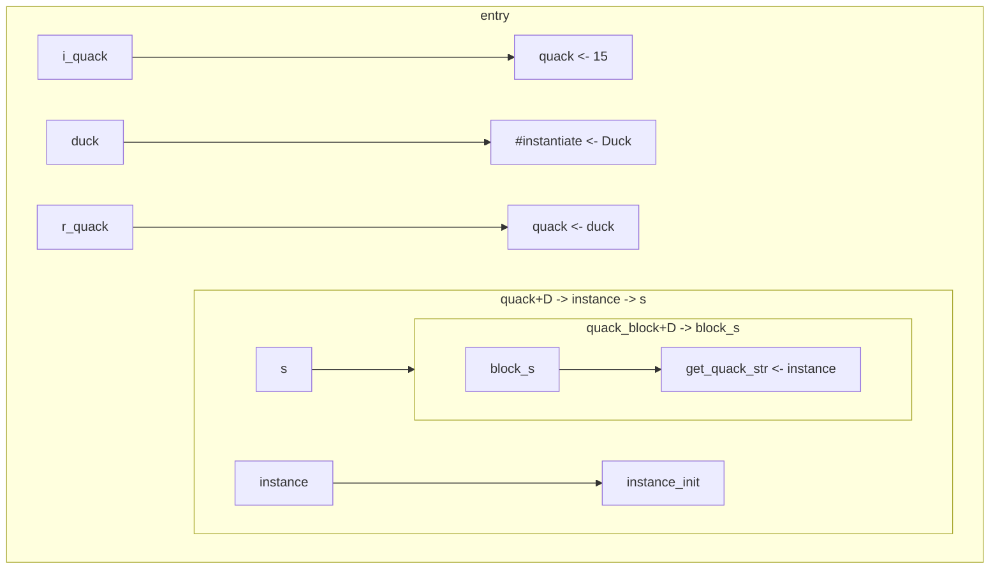
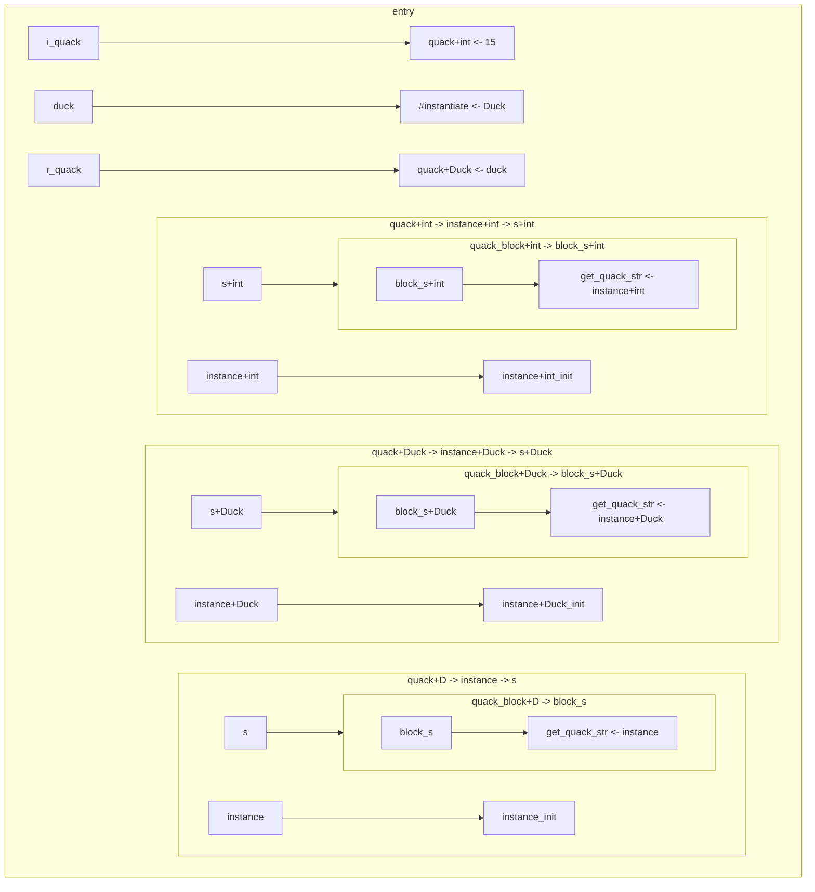
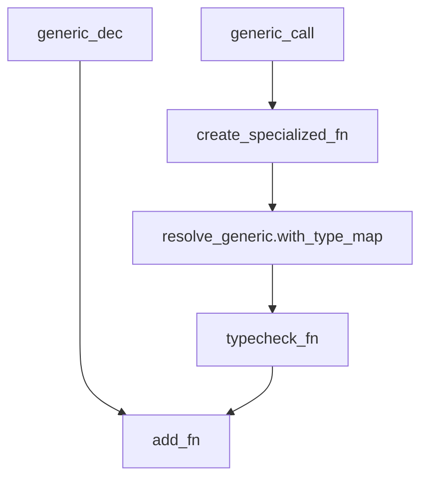

# Canonicalization and generics in jinko

## Rules

- Each block is its own subgraph
- Each line of the graph corresponds to an instruction
- Each arrow is an assignment
    - statements simply have their return value "ignored" in this representation
    - `_ -> stmt`
- Function declaration
    - syntax: `<func_name> -> [ <arg> [, <arg>]* ] -> <ret_val>`
    - examples: `println -> s -> `, `takes_nothing -> -> `, `return_value -> -> x`
    - macro:
```rust
($f_name:ident -> $($arg:ident),* -> $($ret_type:ident)?)
```
- Function call
    - syntax: `<func_name> <- [ <arg> [, <arg>]* ]`
    - examples: `println <- 'hey'`, `takes_nothing <- `, `return_value <- `
    - macro:
```rust
($f_name:ident <- $($arg:ident),*)
```

### Example graph

```rust
func f(a: int, b: int) -> int {
    print(a);
    a + b
}
```



## Problem

Generating specialized function during generic expansion [1] causes specialized functions to be dropped when exiting the current typechecking scope.

Specialized functions (i.e. expanded generics) need to be generated and put in the outermost scopemap in order to not get deleted when exiting the current scope.

[1]: A generic function can be declared and will be expanded right after typechecking
```rust
// Original code
func quack[D](instance: D) -> string {
    instance.get_quack_str()
}

i_quack = 15.quack();

type Duck;
fn get_quack_str(d: Duck) -> string { "quack" }

r_quack = Duck.quack();
```
```rust
// after typechecking
func quack[D](instance: D) -> string {
    instance.get_quack_str()
}

i_quack = 15.quack();
// 15 <- int
// We want quack[int](instance: int) -> string

type Duck;
fn get_quack_str(d: Duck) -> string { "quack" }

r_quack = Duck.quack();
// Duck <- Duck
// We want quack[Duck](instance: Duck) -> string
```
```rust
// specialization/monomorphization
func quack[D](instance: D) -> string {
    instance.get_quack_str()
}

func quack+int(instance: int) -> string {
    instance.get_quack_str()
} // type error

func quack+Duck(instance: Duck) -> string {
    instance.get_quack_str()
} // Okay!

i_quack = quack[int](15);

type Duck;
fn get_quack_str(d: Duck) -> string { "quack" }

r_quack = quack[Duck](Duck);
```

Sadly, this process happens during typechecking which contains a different scopemap from the execution context.
What we can do is return a vector of generated nodes after the typechecking phase and insert those in the execution context. They however need proper canonicalization, which we'll discuss after.


end result:


Since the end implementation of jinko will have proper paths and canonicalization, we cannot just generate these functions in the outermost scope, or else code like the following would break:
```rust
func outer() {
    func generic[T](lhs: T, rhs: T) -> T { lhs + rhs }
    
    a = generic(15, 14);
    b = generic(5.4, 1.2);
}

func outer_again() {
    func generic[T](lhs: T, rhs: T) -> T { lhs - rhs }
    
    a = generic(15, 14);
    b = generic(5.4, 1.2);
}
```
As the specialized versions of `generic[T]` would both get generated in the outer scope, there would be a name collision.
With canonicalization, the following would instead happen:
```rust
func outer::generic[int](lhs: int, rhs: int) -> int { lhs + rhs }
func outer::generic[float](lhs: float, rhs: float) -> float { lhs + rhs }

func outer_again::generic[int](lhs: int, rhs: int) -> int { lhs - rhs }
func outer_again::generic[float](lhs: float, rhs: float) -> float { lhs - rhs }

func outer() {
    func outer::generic[T](lhs: T, rhs: T) -> T { lhs + rhs }
    
    a = outer::generic(15, 14);
    b = outer::generic(5.4, 1.2);
}

func outer_again() {
    func outer_again::generic[T](lhs: T, rhs: T) -> T { lhs - rhs }
    
    a = outer_again::generic(15, 14);
    b = outer_again::generic(5.4, 1.2);
}
```

## Generics resolving



## Generics visitor

```rust
// stdlib/vec.jk
type Vec[T](pointer: RawPointer);

func create_vec[T]() -> Vec[T] {
    Vec[T](pointer: 0x0)
}

func push[T](v: Vec[T], elt: T) {
    inner_init[T](v);
    inner_grow[T](v, elt);
}

// main.jk
v = create_vec[int]();
v.push[int](14);
```

```rust
// stdlib/vec.jk
type Vec[T](pointer: RawPointer);

struct TypeId {
    id: Symbol, // T
    generics: Vec<TypeId>, // []
}

// [T -> int]

struct TypeId {
    id: Symbol, // int
    generics: Vec<TypeId>, // []
}

// add_specialized_node(SpecializedNode::Type(new_type));

func create_vec+int() -> Vec+int {
    // [T -> int]
    Vec+int(pointer: RawPointer(0x0))
}

func create_vec[T]() -> Vec[T] {
    Vec[T](pointer: RawPointer(0x0))
}

func push+int(v: Vec+int, elt: int) {
    inner_init+int(v);
    inner_grow+int(v, elt);
}

func push[T](v: Vec[T], elt: T) {
    inner_init[T](v);
    inner_grow[T](v, elt);
}

// main.jk
v = create_vec[int](); // OK
v.push[int](14);
```

## Generating specialized inner nodes

Nodes defined inside other nodes need to be handled as well

```rust
func id[T](input: T) -> T {
	func inner_id[T](input: T) -> T {
		input
	};

	inner_id[T](input)
}

id[int](15)
```

```rust
func id+int(input: int) -> int {
    // Here in expansion phase
}

func id[T](input: T) -> T {
    func inner_id[T](input: T) -> T {
	  input
    };

    inner_id[T](input)
}

id[int](15)
```

At this point in the expansion phase, we are in a `resolve-usages` phase.
Meaning that we are simply trying to replace usages of generic types with their
resolved counter points, changing from `T` to `int` in that case. However for
the function declaration, we need to create a new definition using the resolved
type: This is a `resolve-expand` phase of the expansion.

We can maybe simply make it so that having a `FunctionDeclaration` in a
`resolve-usages` context creates a new function and adds it as a specialized
node

```rust
func inner_id+int(input: int) -> int {
    input
}

func id+int(input: int) -> int {
    // Remove the declaration node? Just declare it still?

    inner_id+int(input)
}

func id[T](input: T) -> T {
    func inner_id[T](input: T) -> T {
	  input
    };

    inner_id[T](input)
}

id[int](15)
```

## User Specialization

### Choosing specialized items

When calling functions or types, the user may want to call a specialized
version of the item. For example, with the `Maybe` type declared as so
```rust
type Maybe[T](T | Nothing);
```
One could want to declare a function or a type which only accepts a specialized
version of this optional type. This can be seen in builder patterns for example:
```rust
type Parser;
type TypeChecker;
type Generics;
type Hint;

type Location(file: string, line: int, col: int);
type Span(start: Location, end: Maybe[Location] = Nothing);
//                         ^ specialized usage

type Error(
    kind: Parser | TypeChecker | Generics | Hint,
    msg: Maybe[string] = Nothing,    // specialized usage
    exit_code: Maybe[int] = Nothing, // specialized usage
    loc: Maybe[Span] = Nothing,      // specialized usage
    hints: Vector[Error] = Vector(), // specialized usage
);
```

<details>

<summary>Rest of the builder pattern implementation</summary>

```rust

func with_end(span: Span, end: Location) -> Span {
    // Gets promoted to a Maybe[Location] thanks to multi types
    Span(start: span.start, end: end)
}

func hint() -> Error {
    Error(kind: Hint)
}

func with_msg(e: Error, msg: string) -> Error {
    Error(
        kind: e.kind,
        msg: msg,
        exit_code: e.exit_code,
        loc: e.loc,
        hints: e.hints
    )
} // And so on for `exit_code` and `loc`

func with_hint(e: Error, hint: Error) -> Error {
    Error(
        kind: e.kind,
        msg: e.msg,
        exit_code: e.exit_code,
        loc: e.loc,
        hints: e.hints.append(hint)
    )
}

e = Error(kind: TypeChecker)
      .with_msg("something went wrong!")
      .with_hint(hint().with_msg("a hint"))
      .with_hint(hint().with_msg("hint message #2!"));
```

</summary>
</details>

The hard part about implementing "specialization usage" for types is that they
are easily confused with a generic type declaration. What is the difference
between `Maybe[T]` and `Maybe[int]` in the eye of the interpreter?

Let's take a few examples:

```rust
func f1[T](maybe_t: Maybe[T]) {} // Generic `Maybe`
func f2[T](maybe_t: Maybe[string]) {} // Specialized `Maybe`
// -> `string` is not in the generic list
func f3(maybe_t: Maybe[T]) {} // Specialized `Maybe`
// -> typechecker error later on: T is undeclared
```

We can check whether or not the type's generic is present in the function's given
generic list. Let's add another type to our current file:

```rust
type Tuple3[T1, T2, T3](f: T1, s: T2, t: T3);
```

A fully generic version of this type would appear as follows in the interpreter:
```rust
tuple3 = TypeId {
    id: "Tuple3",
    generics: [T1, T2, T3]
}
```
while a fully specialized version (`Tuple3[int, string, float]`) would look like so:
```rust
tuple3 = TypeId {
    id: "Tuple3+int+string+float"
    generics: []
}
```

But we could have an *intermediate* version: One that would contains generics while
still being mangled
```rust
func half_specialized_tuple[T](t: Tuple3[T, string, float]) {}

half_specialized_tuple[float](Tuple3(f: 14.4, s: "hey", t: 14.0));
half_specialized_tuple[string](Tuple3(f: "jinko", s: "language", t: 0.3));
```

The type in the function declaration would be a hybrid between a generic type and a
fully specialized one. Something like a "delayed specialized" type, where its
full specialization will happen further down the type resolution pass.

```rust
tuple3 = TypeId {
    id: "Tuple+string+float"
    generics: [T]
}
```

This highlights a fun issue in our mangler! We need to also specify the position
of the specialized type to make sure we can then rebuild the type properly.

If all goes well, we should not have to implement any further logic in our
generic resolver/specializer.

### Declaring specialized items

We must allow the user to specialize their own version of the generic declaration.

### How to choose the user specialized instead of our specialize
### Not generating stuff multiple time
