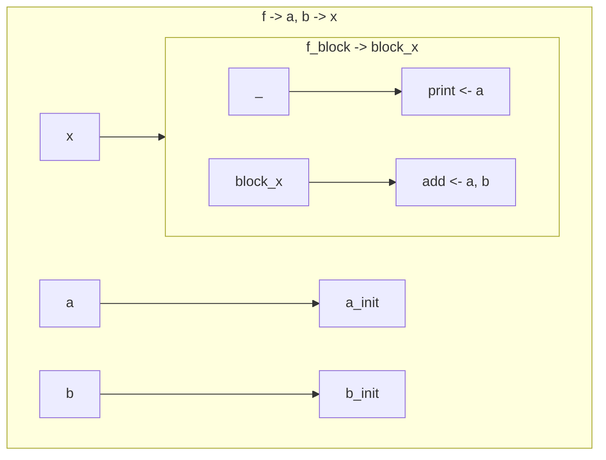
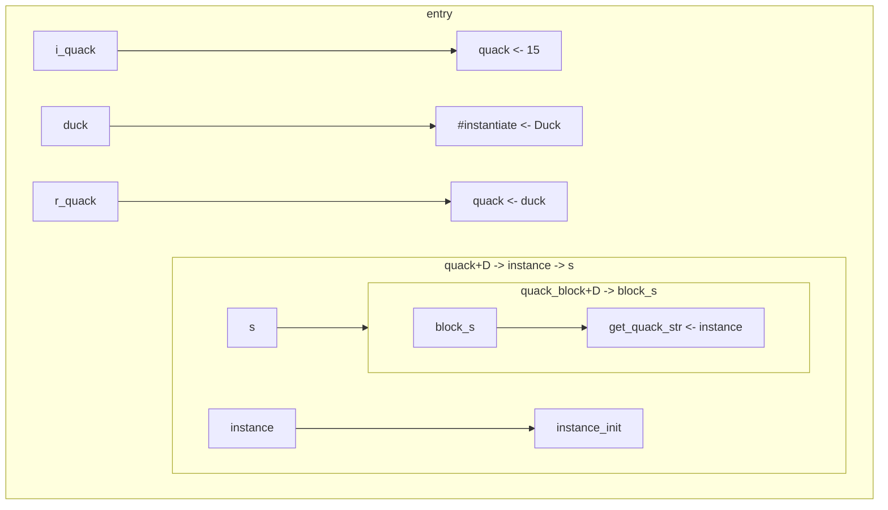
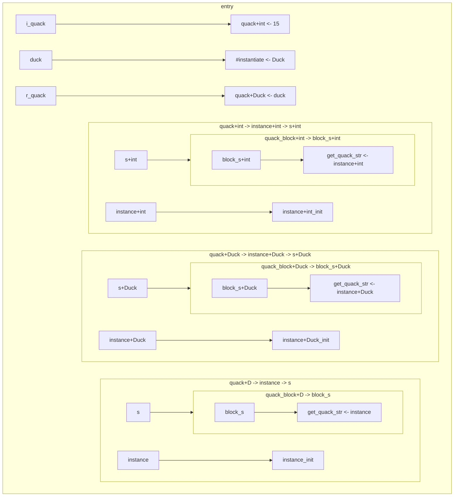
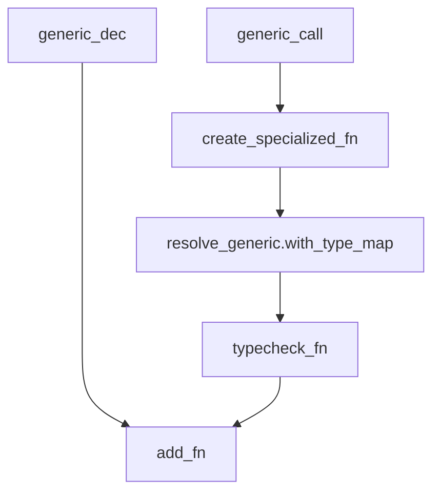

# Canonicalization and generics in jinko

## Rules

- Each block is its own subgraph
- Each line of the graph corresponds to an instruction
- Each arrow is an assignment
    - statements simply have their return value "ignored" in this representation
    - `_ -> stmt`
- Function declaration
    - syntax: `<func_name> -> [ <arg> [, <arg>]* ] -> <ret_val>`
    - examples: `println -> s -> `, `takes_nothing -> -> `, `return_value -> -> x`
    - macro:
```rust
($f_name:ident -> $($arg:ident),* -> $($ret_type:ident)?)
```
- Function call
    - syntax: `<func_name> <- [ <arg> [, <arg>]* ]`
    - examples: `println <- 'hey'`, `takes_nothing <- `, `return_value <- `
    - macro:
```rust
($f_name:ident <- $($arg:ident),*)
```

### Example graph

```rust
func f(a: int, b: int) -> int {
    print(a);
    a + b
}
```



## Problem

Generating specialized function during generic expansion [1] causes specialized functions to be dropped when exiting the current typechecking scope.

Specialized functions (i.e. expanded generics) need to be generated and put in the outermost scopemap in order to not get deleted when exiting the current scope.

[1]: A generic function can be declared and will be expanded right after typechecking
```rust
// Original code
func quack[D](instance: D) -> string {
    instance.get_quack_str()
}

i_quack = 15.quack();

type Duck;
fn get_quack_str(d: Duck) -> string { "quack" }

r_quack = Duck.quack();
```
```rust
// after typechecking
func quack[D](instance: D) -> string {
    instance.get_quack_str()
}

i_quack = 15.quack();
// 15 <- int
// We want quack[int](instance: int) -> string

type Duck;
fn get_quack_str(d: Duck) -> string { "quack" }

r_quack = Duck.quack();
// Duck <- Duck
// We want quack[Duck](instance: Duck) -> string
```
```rust
// specialization/monomorphization
func quack[D](instance: D) -> string {
    instance.get_quack_str()
}

func quack+int(instance: int) -> string {
    instance.get_quack_str()
} // type error

func quack+Duck(instance: Duck) -> string {
    instance.get_quack_str()
} // Okay!

i_quack = quack[int](15);

type Duck;
fn get_quack_str(d: Duck) -> string { "quack" }

r_quack = quack[Duck](Duck);
```

Sadly, this process happens during typechecking which contains a different scopemap from the execution context.
What we can do is return a vector of generated nodes after the typechecking phase and insert those in the execution context. They however need proper canonicalization, which we'll discuss after.


end result:


Since the end implementation of jinko will have proper paths and canonicalization, we cannot just generate these functions in the outermost scope, or else code like the following would break:
```rust
func outer() {
    func generic[T](lhs: T, rhs: T) -> T { lhs + rhs }
    
    a = generic(15, 14);
    b = generic(5.4, 1.2);
}

func outer_again() {
    func generic[T](lhs: T, rhs: T) -> T { lhs - rhs }
    
    a = generic(15, 14);
    b = generic(5.4, 1.2);
}
```
As the specialized versions of `generic[T]` would both get generated in the outer scope, there would be a name collision.
With canonicalization, the following would instead happen:
```rust
func outer::generic[int](lhs: int, rhs: int) -> int { lhs + rhs }
func outer::generic[float](lhs: float, rhs: float) -> float { lhs + rhs }

func outer_again::generic[int](lhs: int, rhs: int) -> int { lhs - rhs }
func outer_again::generic[float](lhs: float, rhs: float) -> float { lhs - rhs }

func outer() {
    func outer::generic[T](lhs: T, rhs: T) -> T { lhs + rhs }
    
    a = outer::generic(15, 14);
    b = outer::generic(5.4, 1.2);
}

func outer_again() {
    func outer_again::generic[T](lhs: T, rhs: T) -> T { lhs - rhs }
    
    a = outer_again::generic(15, 14);
    b = outer_again::generic(5.4, 1.2);
}
```

## Generics resolving



## Generics visitor

```rust
// stdlib/vec.jk
type Vec[T](pointer: RawPointer);

func create_vec[T]() -> Vec[T] {
    Vec[T](pointer: 0x0)
}

func push[T](v: Vec[T], elt: T) {
    inner_init[T](v);
    inner_grow[T](v, elt);
}

// main.jk
v = create_vec[int]();
v.push[int](14);
```

```rust
// stdlib/vec.jk
type Vec[T](pointer: RawPointer);

struct TypeId {
    id: Symbol, // T
    generics: Vec<TypeId>, // []
}

// [T -> int]

struct TypeId {
    id: Symbol, // int
    generics: Vec<TypeId>, // []
}

// add_specialized_node(SpecializedNode::Type(new_type));

func create_vec+int() -> Vec+int {
    // [T -> int]
    Vec+int(pointer: RawPointer(0x0))
}

func create_vec[T]() -> Vec[T] {
    Vec[T](pointer: RawPointer(0x0))
}

func push+int(v: Vec+int, elt: int) {
    inner_init+int(v);
    inner_grow+int(v, elt);
}

func push[T](v: Vec[T], elt: T) {
    inner_init[T](v);
    inner_grow[T](v, elt);
}

// main.jk
v = create_vec[int](); // OK
v.push[int](14);
```
